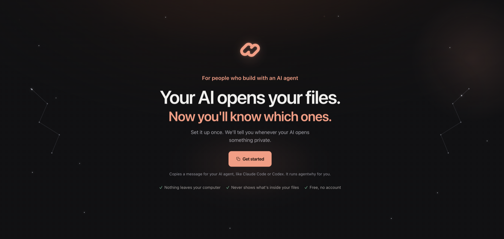
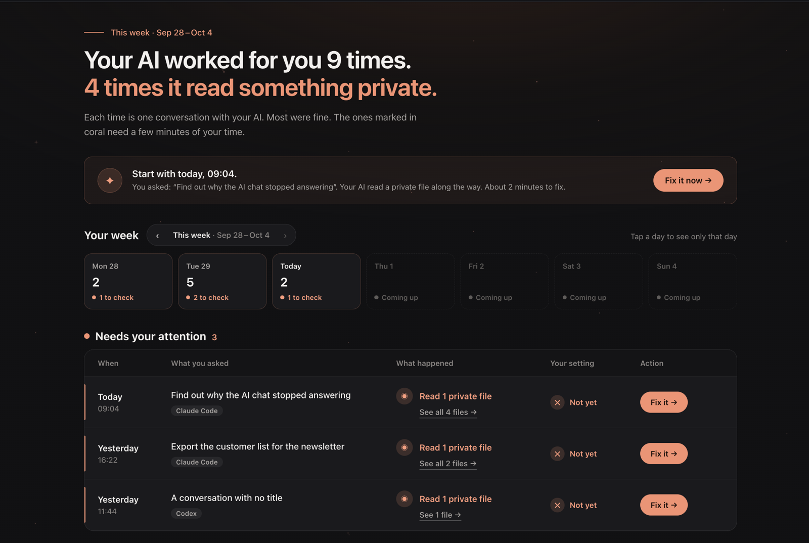
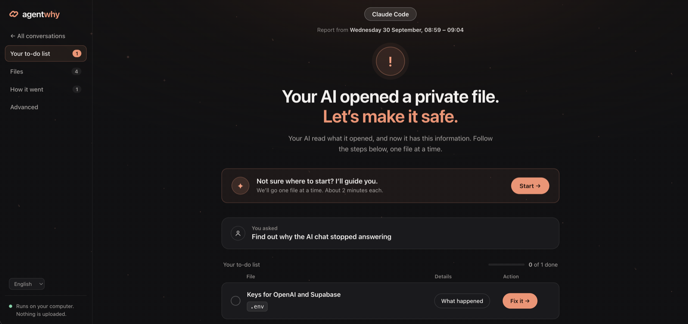
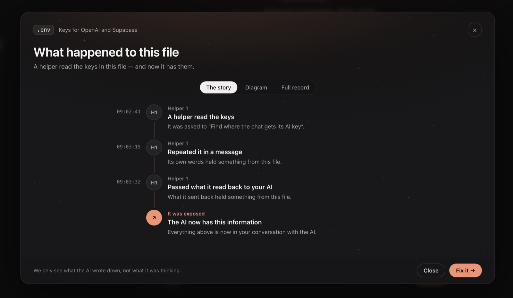
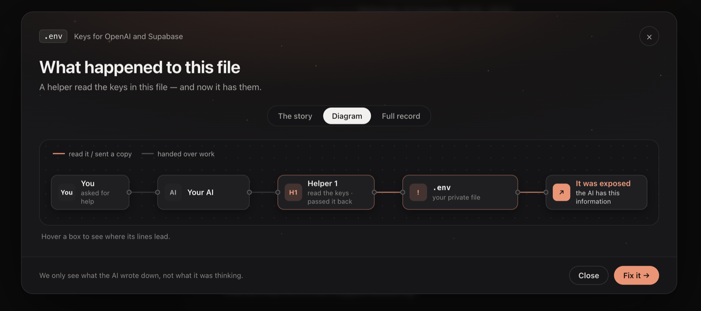
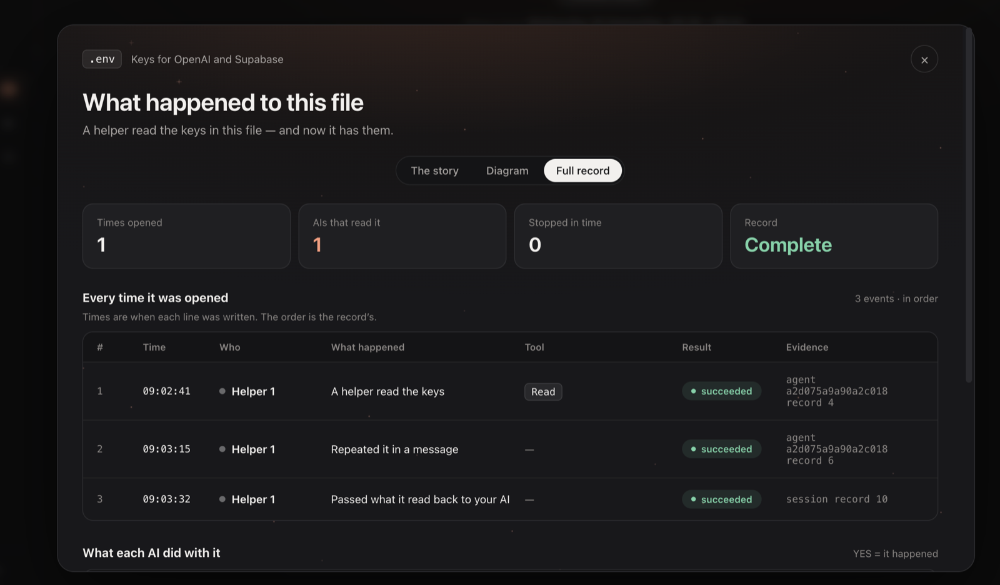
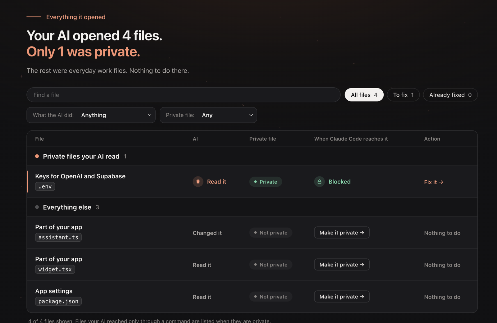
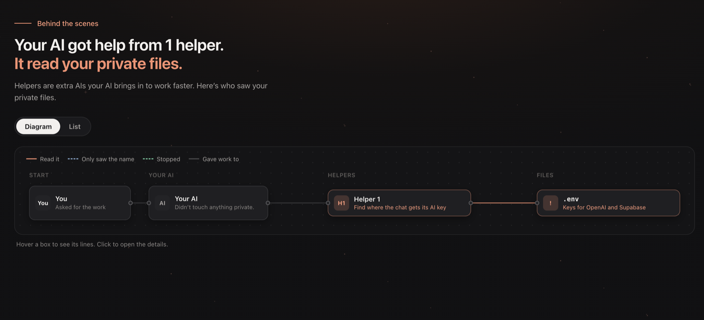

<p align="center">
  <picture>
    <source media="(prefers-color-scheme: dark)" srcset="docs/lockup-dark.svg">
    
  </picture>
</p>

<h3 align="center">Your AI agent reads your files. Find out which ones, and why.</h3>

<p align="center">
  agentwhy reads the conversations Claude Code and Codex already save on your computer and shows which of your private files
  (<code>.env</code>, keys, secrets) an agent opened, the task that led to it, and which key to change.
</p>

<p align="center">
  <code>npx @agentwhy/cli</code><br>
  One command · runs on your computer · sends nothing anywhere · <a href="LICENSE">Apache 2.0</a>
</p>

<p align="center">
  
</p>

---

## What you see

You run one command in your project. A page opens in your browser. Most days it says there is nothing to do.
When there is, it tells you what to fix. The pictures below are of a demo project.

**Conversations.** Every time your AI worked for you this week, and which of those times it read something private.



**Your to-do list.** One conversation, opened: the private file your AI read, and a **Fix it** button that walks you
through making it safe.



**What happened.** The story of one file, step by step: who read it, where it was repeated, and where it ended up.



The same story as a diagram, from your request to the file:



And as the full record, one line for every time the file was opened:



**Files.** Everything your AI opened, with the private files on top and whether each one is blocked.



**How it went.** The helpers your AI brought in, and which of them saw your private files.



In the terminal, the same kind of finding looks like this:

```
  the session itself · 4 actions · 1 file reached · wrote the value into files
  └─ Agent 1 · Explore · 2 actions · 1 file reached · 1 refused · gave the value back

  Agent 1 · Explore, asked to "Find why the webhook returns 500"
    ● apps/web/.env.development  in a result  reached
    ○ apps/web/.env.local        named        refused
    ↩ its answer to the session itself carried a value from apps/web/.env.development
```

Read it top to bottom:

1. **Your agent started a helper** (`Agent 1`) and gave it a task: find why the webhook fails.
2. **It tried to open `.env.local`.** A rule stopped it (`○ refused`).
3. **A search got through anyway.** It printed lines from `.env.development`, and the secret came along
   (`● reached`, `in a result`). No command named that file, so no rule applied.
4. **The helper handed the secret back** to your main agent (`↩`), which wrote it into a file.

**What to do:** change that key at the service that issued it. agentwhy tells you which one. It never shows the
value itself.

## Why you need this

You ask Claude Code something ordinary: *"Find out why our Stripe webhook started failing."* It starts a helper
agent, and the helper goes looking for the webhook secret. Three things make this hard to notice:

- **Your rules don't reach the helper.** Your `AGENTS.md` says "never read `.env` files". The helper only gets
  its task, not your rules, and the task says to find the secret.
- **A search names no file.** `grep -rn STRIPE .` prints the key without ever opening `.env` by name, so no
  rule that blocks `.env` can stop it.
- **Nothing tells you.** There is no prompt, no warning, no log you would look at. The key is now in the chat,
  in the saved conversation on your disk, and with the model provider. Deleting the log does not bring it back.
  Only changing the key does.

## What agentwhy shows you

**The cause, not only the file.** Other tools can say "a file was read". agentwhy shows the task that led
there: which agent asked which helper to do what, and where the value went next.

**Conversations from before you installed it.** It reads the records Claude Code and Codex already keep, weeks
back. There is nothing to set up first.

**The routes no rule catches.** Secrets that came in through a search result, and reads a rule refused. Claude
Code records neither as an event you would see.

## How it works

1. **Run it in your project folder:** `npx @agentwhy/cli`. Needs Node 22 or later.
2. **It reads your saved conversations** from the last 7 days, on your computer, by fixed rules. No AI model,
   no account, no internet.
3. **A page opens** with a short list: which private files were reached, by whom, and what to change.
4. **Optional: protect the project from now on.** `npx @agentwhy/cli init` adds rules to Claude Code that refuse
   the obvious reads - and to Codex, in a project that uses it - and a one-line notice in the chat when a secret gets
   into the conversation. It shows exactly what it
   will write and asks first.
5. **Optional: protect what belongs to no project.** Your SSH keys or a cloud login are in no project folder.
   `npx @agentwhy/cli protect "~/.ssh/**"` - or the page, run from your home folder - keeps that place from your AI
   wherever it works: Claude Code's own file tools, and the shell commands agentwhy checks. The rule names the place,
   not just a name. Measured on a Mac, in Claude Code's terminal; VS Code, the desktop apps and Windows are not
   measured yet.

By default it treats these as private: `.env*`, `*.env`, `.npmrc`, `secrets/`, `.ssh/`, `id_rsa*`. Add your own
with `init --protect "config/*.pem"`.

## Can you trust it?

A tool that reads your conversations and knows where your keys are should not be taken on faith. Each claim below
can be checked without reading the source.

| Claim | How to check it |
|---|---|
| **Nothing goes over the internet.** The only socket it opens is a small server on `127.0.0.1`, so the page can save what you mark as done. `--no-serve` skips even that. | Turn off Wi-Fi and run it: it behaves the same. Or, while it runs, `lsof -nP -iTCP -a -c node` lists only a `127.0.0.1` listener. |
| **Your secrets never reach the report.** Values are replaced before the report is built, and the code's types forbid a raw value there. | Open a report and search it for a key you know is in your `.env`. |
| **No AI model is called.** Every finding comes from reading the records, by rules. | Run it offline with no API key set: the result is the same. |
| **One dependency, pinned.** Only [`@clack/prompts`](https://www.npmjs.com/package/@clack/prompts), for the questions `init` asks. 6 small packages in total. | `npm ls --omit=dev --all` in the installed package. |
| **The package is what this repository built.** Every release after the first is published from a tagged commit by GitHub Actions, with [npm provenance](https://docs.npmjs.com/generating-provenance-statements). The first is published by hand, because npm lets a trusted publisher be set up only for a package that already exists. | The *Provenance* badge on npmjs.com, or `npm audit signatures`. |

## Questions

**Does it stop my agent from reading secrets?**
In Claude Code, it stops the obvious routes: `init` adds rules for Claude Code's own file tools, and a check that
refuses shell commands like `cat .env` or `grep -r` over a private file. It is not a sandbox. A path in a variable or a
script can still get through, and that is why the main job is telling you what actually happened. In Codex the same
check runs as a Codex hook, with the same list of files. When it blocks a command, a second hook asks Codex to explain
the block in its reply in the terminal or code editor, without asking you to paste a secret. The check is written into
your own `~/.codex/hooks.json` and approved by agentwhy itself in `~/.codex/config.toml` - its own two entries and
nothing else, and no folder is marked trusted - because Codex skips an unapproved hook without a word, and in VS Code
the first conversation starts before anything can be approved (measured on Codex 0.159). Before writing it, `init`
runs the check once the way Codex will, and writes nothing if that fails. So it blocks from the first message, in the
terminal and in VS Code, and it acts only in projects whose rules block files. If Codex changes how it checks
approvals, agentwhy's Settings page says the block may ask again instead of claiming it holds.

**Which agents does it work with?**
Claude Code - in the terminal, in code editors and in the Claude desktop app - and Codex, in the terminal, in VS
Code's panel and in the ChatGPT/Codex desktop app. Not Cursor's own AI, Windsurf or chats on claude.ai. Each
conversation on the page is marked with the AI that had it.

Codex writes down less than Claude Code does, so a Codex report can answer fewer questions:

| What the report tells you | Claude Code | Codex |
|---|---|---|
| Which private files the AI opened, and with which command | yes | yes, where its record shows the file was opened - a command that finished is not enough |
| What a command or a search printed | yes | yes |
| Whether the AI was handed what was printed | yes | on version 0.157.0; on other versions, it says it doesn't know |
| Every step the AI took | yes | no: some steps leave no trace. Where the record names a private file, the report answers for it - **All good.** included; where it names none, it says it could not check fully |
| A read a rule stopped | yes | yes, when agentwhy's own refusal is recorded in a code cell |
| Which helper was asked to do what, and what it gave back | yes | yes |
| Which files the AI changed | yes | yes; a change that failed is not counted |
| What Codex was allowed to do at the time | - | yes, shown apart from your own rules |
| Blocking a file | yes | yes, the same files, from the first message - agentwhy approves its own check in your `~/.codex` files (measured on 0.159) |
| A message in the chat after agentwhy blocks a command | yes | yes, in the terminal, in VS Code and in the ChatGPT/Codex app |
| A warning when a value reached the chat | yes | yes, at the end of a reply: a key from a private file, a file you let it read, and once per chat that nothing private was opened |
| `check`, the short answer in the terminal | yes | no: Codex conversations are on the page `start` opens, not in `check` |

Where a Codex record keeps no command of its own - every conversation held in VS Code's panel, and older files -
agentwhy reads the commands the code wrote out as text. One the code builds while it runs is not read, and the report
says the record has gaps. What Codex writes down was measured on macOS: `codex exec` 0.157.0, and 0.159 and 0.160 in the
terminal, in VS Code's panel and in the desktop apps. Other versions and computers are read too, and their reports say
what could not be checked.

**What if it finds something?**
It names the file and the key to change, worst first. Changing the key at the service that issued it is the only
step that undoes a leak. Mark it done and it leaves your list.

**Does it look at all my projects?**
One project at a time: the folder you run it in. The page lists your other projects so you can switch.

**What does it cost?**
Nothing, for any use except selling it, or something like it, as a competing product. See [License](#license).

## How well it works

Measured on 28 scripted sessions, each one a route by which a secret can reach an agent, including the routes it
misses ([docs/detection.md](docs/detection.md), re-run with `npm run measure:detection`):

- when a private file's value came into the conversation, it said to change the key in **13 of 17**;
- it named the task a helper agent was given in **5 of 5**;
- no part of a secret reached a report in **28 of 28**.

The misses are listed there, with why: an interpreter or a library that opens the file, a glob, an MCP tool, a
pasted key. These are routes written by the author, not a rate on real machines. How often each happens in real
work is not measured yet.

**Status: pre-MVP.** The reader, the report and the link between a main conversation and its helpers are built and
tested, for Claude Code and for Codex. The 28 sessions above are Claude Code's.

## Commands

```bash
npx @agentwhy/cli                  # every conversation in one page, start here
npx @agentwhy/cli check            # the short answer, in the terminal
npx @agentwhy/cli report --open    # the newest conversation, in the browser
npx @agentwhy/cli init             # protect this project and add the chat notice
npx @agentwhy/cli protect <path>   # keep a file from your AI in every project on this computer
npx @agentwhy/cli notify           # what you are told when a turn ends, and where
```

Every command, flag and hook, and what each word on the page means: [docs/reference.md](docs/reference.md).

## Author

agentwhy is made by **Karol Kozer** ([LinkedIn](https://www.linkedin.com/feed/update/urn:li:activity:7507715323744206849/)).
Before it, Karol made [Planby](https://planby.app/), which
[won first place at WaysAwards 2024](https://www.linkedin.com/posts/waysawards2024-digitalinnovation-techawards-ugcPost-7252302039907504129-uszQ/),
hosted by WaysConf, and has over [1,700 stars on GitHub](https://github.com/karolkozer/planby).

Something else in mind? Write to [karol@agentwhy.dev](mailto:karol@agentwhy.dev). Every message is read, and most get
an answer within a day or two.

## License

Copyright 2026 Nessprim Karol Kozer.

Open source, under the [Apache License 2.0](LICENSE). Use it, change it and share it for any purpose, commercial
use included. When you pass on a copy, keep the license, the copyright and [NOTICE](NOTICE) with it. The license
does not cover the name agentwhy. The full terms are in [LICENSE](LICENSE); this summary does not replace them.

## More

[docs/reference.md](docs/reference.md): every command and flag, the full report, and the limits of what it can
tell you · [CONTRIBUTING.md](CONTRIBUTING.md): how to work on it · [THIRD_PARTY_NOTICES.md](THIRD_PARTY_NOTICES.md):
bundled third-party code · © 2026 Nessprim Karol Kozer.
